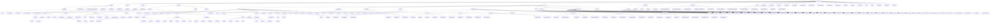

# Mermaid optimized folder structure

```mermaid
graph TD
  %% Root folder
  Conclave["/Conclave"]

  %% Top-level folders
  GitHub[".github"]
  Vercel[".vercel"]
  Config[".config"]
  Public["public"]
  Src["src"]
  Scripts["scripts"]
  Database["database"]
  Blueprint["blueprint"]
  Docs["docs"]

  %% Files in root
  packageJson["package.json"]
  jsconfigJson["jsconfig.json"]
  vercelJson["vercel.json"]
  manifestJson["manifest.json"]
  nextConfig["next.config.js"]
  tailwindConfig["tailwind.config.js"]
  postcssConfig["postcss.config.js"]
  supabaseConfig["supabase.config.js"]
  prettierConfig["prettier.config.js"]
  cspellConfig["cspell.config.js"]
  eslintConfig[".eslintrc.js"]
  gitignore[".gitignore"]
  envExample[".env.example"]
  env[".env"]
  nvmrc[".nvmrc"]
  stylelintConfig[".stylelintrc.js"]
  vercelIgnore[".vercelignore"]
  envLocal[".env.local"]

  %% Connect root files
  Conclave --> GitHub
  Conclave --> Vercel
  Conclave --> Config
  Conclave --> Public
  Conclave --> Src
  Conclave --> Scripts
  Conclave --> Database
  Conclave --> Blueprint
  Conclave --> Docs

  Conclave --> packageJson
  Conclave --> jsconfigJson
  Conclave --> vercelJson
  Conclave --> manifestJson
  Conclave --> nextConfig
  Conclave --> tailwindConfig
  Conclave --> postcssConfig
  Conclave --> supabaseConfig
  Conclave --> prettierConfig
  Conclave --> cspellConfig
  Conclave --> eslintConfig
  Conclave --> gitignore
  Conclave --> envExample
  Conclave --> env
  Conclave --> nvmrc
  Conclave --> stylelintConfig
  Conclave --> vercelIgnore
  Conclave --> envLocal

  %% .github folder and subfolders
  GitHub --> Workflows["workflows"]
  GitHub --> IssueTemplates["ISSUE_TEMPLATE"]
  GitHub --> pullRequestTemplate["PULL_REQUEST_TEMPLATE.md"]
  GitHub --> security["SECURITY.md"]
  GitHub --> funding["FUNDING.yml"]
  GitHub --> support["SUPPORT.md"]

  Workflows --> ci["ci.yml"]
  Workflows --> deploy["deploy.yml"]
  Workflows --> codeQuality["code-quality.yml"]

  IssueTemplates --> bugReport["bug_report.md"]
  IssueTemplates --> featureRequest["feature_request.md"]
  IssueTemplates --> generalQuestion["general_question.md"]

  %% .vercel folder
  Vercel --> projectJson["project.json"]

  %% .config folder
  Config --> jestConfig["jest.config.js"]
  Config --> vitestConfig["vitest.config.js"]

  %% public folder and subfolders
  Public --> Assets["Assets"]
  Public --> Audio["Audio"]
  Public --> favicon["favicon"]

  Assets --> Images["Images"]
  Assets --> Videos["Videos"]
  Assets --> fonts["fonts"]
  Assets --> cursors["cursors"]

  Images --> nobility["nobility"]
  Images --> Pathways["Pathways"]
  Images --> gallery["gallery"]
  Images --> luxury["luxury"]

  Pathways --> gaming["gaming"]
  Pathways --> lorebound["lorebound"]
  Pathways --> productive["productive"]
  Pathways --> news["news"]

  Videos --> heroLoop["hero-loop.mp4"]
  Videos --> pathwayIntros["pathway-intros"]

  fonts --> playfair["playfair-display"]
  fonts --> inter["inter"]
  fonts --> josefin["Josefin_sans"]
  fonts --> ringOfKerry["Ring Of Kerry"]
  fonts --> orbitron["Orbitron"]
  fonts --> cinzel["Cinzel_Decorative"]

  cursors --> defaultCursor["default.png"]
  cursors --> hoverCursor["hover.png"]

  Audio --> hoverMp3["hover.mp3"]
  Audio --> notificationMp3["notification.mp3"]

  favicon --> faviconIco["favicon.ico"]

  %% src folder and subfolders
  Src --> app["app"]
  Src --> middleware["middleware"]
  Src --> constants["constants"]
  Src --> types["types"]
  Src --> components["components"]
  Src --> lib["lib"]
  Src --> hooks["hooks"]
  Src --> styles["styles"]
  Src --> data["data"]

  %% app subfolders and files
  app --> layout["layout.jsx"]
  app --> page["page.jsx"]
  app --> pathways["pathways"]
  app --> hallOfNobles["hall-of-nobles"]
  app --> court["court"]
  app --> archives["archives"]
  app --> chambers["chambers"]
  app --> artGallery["art-gallery"]
  app --> sanctum["sanctum"]
  app --> throneRoom["throne-room"]
  app --> gateway["gateway"]
  app --> api["api"]

  pathways --> pathwaysLayout["layout.jsx"]
  pathways --> gamingPathway["gaming"]
  pathways --> loreboundPathway["lorebound"]
  pathways --> productivePathway["productive"]
  pathways --> newsPathway["news"]

  gamingPathway --> gamingPage["page.jsx"]
  gamingPathway --> tournaments["tournaments"]
  gamingPathway --> leaderboards["leaderboards"]
  gamingPathway --> botHelp["bot-help"]
  gamingPathway --> gameNews["game-news"]

  loreboundPathway --> loreboundPage["page.jsx"]
  loreboundPathway --> library["library"]
  loreboundPathway --> reviews["reviews"]
  loreboundPathway --> collections["collections"]
  loreboundPathway --> sites["sites"]

  productivePathway --> productivePage["page.jsx"]
  productivePathway --> resources["resources"]
  productivePathway --> challenges["challenges"]
  productivePathway --> showcase["showcase"]

  newsPathway --> newsPage["page.jsx"]
  newsPathway --> breaking["breaking"]
  newsPathway --> science["science"]
  newsPathway --> tech["tech"]
  newsPathway --> local["local"]
  newsPathway --> analysis["analysis"]
  newsPathway --> discussions["discussions"]

  chambers --> dashboard["dashboard"]
  chambers --> preferences["preferences"]
  chambers --> achievements["achievements"]

  api --> auth["auth"]
  api --> discordApi["discord"]
  api --> adminApi["admin"]
  api --> webhooks["webhooks"]

  auth --> discordOAuth["discord"]

  %% middleware files
  middleware --> authMiddleware["auth.js"]
  middleware --> rateLimit["rateLimit.js"]
  middleware --> roleCheck["roleCheck.js"]
  middleware --> logger["logger.js"]

  %% constants files
  constants --> roles["roles.js"]
  constants --> permissions["permissions.js"]
  constants --> pathwaysConstants["pathways.js"]
  constants --> colors["colors.js"]
  constants --> config["config.js"]

  %% types files
  types --> userTypes["user.js"]
  types --> pathwayTypes["pathway.js"]
  types --> eventTypes["event.js"]
  types --> discordTypes["discord.js"]

  %% components subfolders and files
  components --> ui["ui"]
  components --> layoutComponents["layout"]
  components --> authComponents["auth"]
  components --> pathwaysComponents["pathways"]
  components --> contentComponents["content"]
  components --> formsComponents["forms"]
  components --> interactiveComponents["interactive"]
  components --> adminComponents["admin"]

  ui --> nobleCursor["NobleCursor.jsx"]
  ui --> superButton["SuperButton.jsx"]
  ui --> luxuryButton["LuxuryButton.jsx"]
  ui --> glassCard["GlassCard.jsx"]
  ui --> nobleInput["NobleInput.jsx"]
  ui --> loadingCrest["LoadingCrest.jsx"]

  layoutComponents --> navbar["Navbar.jsx"]
  layoutComponents --> footer["Footer.jsx"]
  layoutComponents --> sidebar["Sidebar.jsx"]
  layoutComponents --> searchbar["Searchbar.jsx"]
  layoutComponents --> pathwayNav["PathwayNav.jsx"]

  authComponents --> discordLogin["DiscordLogin.jsx"]
  authComponents --> authGuard["AuthGuard.jsx"]
  authComponents --> memberVerify["MemberVerify.jsx"]

  pathwaysComponents --> pathwayHero["PathwayHero.jsx"]
  pathwaysComponents --> pathwayCard["PathwayCard.jsx"]
  pathwaysComponents --> pathProgress["PathProgress.jsx"]
  pathwaysComponents --> pathRecommend["PathRecommend.jsx"]

  contentComponents --> eventCard["EventCard.jsx"]
  contentComponents --> memberSpotlight["MemberSpotlight.jsx"]
  contentComponents --> articleCard["ArticleCard.jsx"]
  contentComponents --> galleryGrid["GalleryGrid.jsx"]
  contentComponents --> announcementBanner["AnnouncementBanner.jsx"]

  formsComponents --> contactForm["ContactForm.jsx"]
  formsComponents --> appealForm["AppealForm.jsx"]
  formsComponents --> applicationForm["ApplicationForm.jsx"]
  formsComponents --> submissionForm["SubmissionForm.jsx"]
  formsComponents --> complaintForm["ComplaintForm.jsx"]

  interactiveComponents --> quizEngine["QuizEngine.jsx"]
  interactiveComponents --> badgeSystem["BadgeSystem.jsx"]
  interactiveComponents --> musicPlayer["MusicPlayer.jsx"]
  interactiveComponents --> liveStats["LiveStats.jsx"]
  interactiveComponents --> notificationCenter["NotificationCenter.jsx"]

  adminComponents --> contentManager["ContentManager.jsx"]
  adminComponents --> memberManager["MemberManager.jsx"]
  adminComponents --> eventCreator["EventCreator.jsx"]
  adminComponents --> analyticsDash["AnalyticsDash.jsx"]

  %% lib folder files
  lib["lib"]
  Src --> lib
  lib --> supabase["supabase.js"]
  lib --> discordLib["discord.js"]
  lib --> authLib["auth.js"]
  lib --> permissionsLib["permissions.js"]
  lib --> analyticsLib["analytics.js"]
  lib --> utils["utils.js"]

  %% hooks folder files
  hooks["hooks"]
  Src --> hooks
  hooks --> useAuth["useAuth.js"]
  hooks --> useDiscord["useDiscord.js"]
  hooks --> usePathways["usePathways.js"]
  hooks --> useLuxuryTheme["useLuxuryTheme.js"]
  hooks --> useSound["useSound.js"]

  %% styles folder files
  styles["styles"]
  Src --> styles
  styles --> globalsCss["globals.css"]
  styles --> contentCss["content.css"]
  styles --> luxuryCss["luxury.css"]
  styles --> pathwaysCss["pathways.css"]
  styles --> superbuttonsCss["superbuttons.css"]
  styles --> designSystemCss["design_system.css"]
  styles --> typographyCss["typography.css"]
  styles --> buttonsCss["buttons.css"]
  styles --> animationsCss["animations.css"]
  styles --> interactiveCss["interactive.css"]
  styles --> inputsCss["inputs.css"]
  styles --> glasscardsCss["glasscards.css"]
  styles --> navbarCss["navbar.css"]
  styles --> cursorsCss["cursors.css"]

  %% data folder files
  data["data"]
  Src --> data
  data --> pathwaysData["pathways.js"]
  data --> staffData["staff.js"]
  data --> eventsData["events.js"]
  data --> loreData["lore.js"]

  %% scripts folder files
  Scripts --> setupDb["setup-db.js"]
  Scripts --> seedData["seed-data.js"]
  Scripts --> migrate["migrate.js"]
  Scripts --> generateSitemap["generate-sitemap.js"]
  Scripts --> optimizeImages["optimize-images.js"]
  Scripts --> backupDb["backup-db.js"]
  Scripts --> syncDiscordRoles["sync-discord-roles.js"]
  Scripts --> deploy["deploy.js"]

  %% database folder and subfolders
  Database --> migrations["migrations"]
  Database --> seeds["seeds"]
  Database --> functions["functions"]
  Database --> schemaSql["schema.sql"]

  %% blueprint folder files
  Blueprint --> folderStructureMd["FOLDER_STRUCTURE.md"]
  Blueprint --> databaseSchemaMd["DATABASE_SCHEMA.md"]
  Blueprint --> apiEndpointsMd["API_ENDPOINTS.md"]
  Blueprint --> componentHierarchyMd["COMPONENT_HIERARCHY.md"]
  Blueprint --> userFlowsMd["USER_FLOWS.md"]
  Blueprint --> designTokensMd["DESIGN_TOKENS.md"]

  %% docs folder files
  Docs --> luxuryDesignGuideMd["LUXURY_DESIGN_GUIDE.md"]
  Docs --> pathwaySystemMd["PATHWAY_SYSTEM.md"]
  Docs --> deploymentMd["DEPLOYMENT.md"]
  Docs --> componentsMd["COMPONENTS.md"]
  Docs --> readmeMd["README.md"]
  Docs --> architectureMd["ARCHITECTURE.md"]
```
